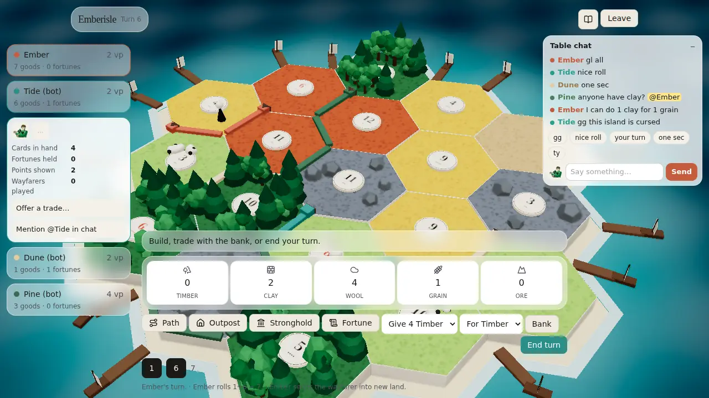
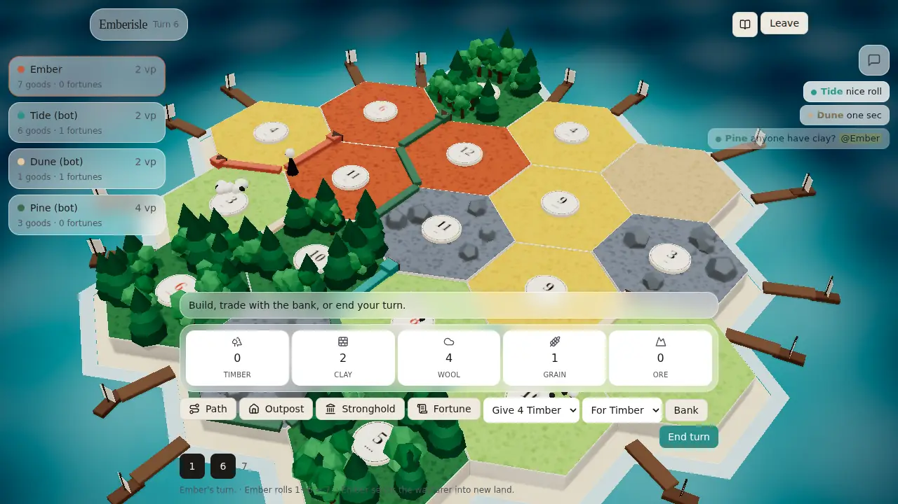
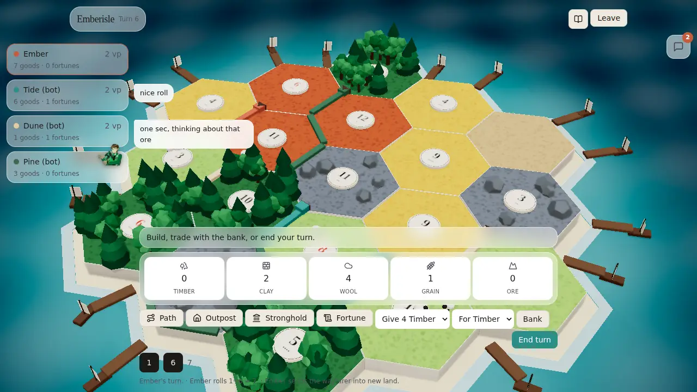

# Table chat, emoji reactions, and the player action menu (issue #119)

Sources: [docs/research/chat.md](../research/chat.md) (#118), Jarrod's UX asks in #119 (2026-09-27),
[BUILD_BIBLE §4.1-4.4](../BUILD_BIBLE.md), [visual-polish.md §1 and §8](../research/visual-polish.md),
`server/host.mjs` (`handle`, `openTable`, `sitDown`, `leave`, `new WebSocketServer`), `src/lib/net/table.ts`,
`src/lib/game/store.ts`, `src/components/game/Hud.tsx` (the player list `aside`), and `EmberisleApp.tsx` (`Lobby`).

Target: desktop PC, mouse and keyboard, 1280×720 and up. Phone layouts are out of scope.

## Mockups (1280×720, the real client on turn 6 with the proposal drawn over it)

| | |
|---|---|
| **B, open:** the chat dock open at the top right, and Tide's action menu open in the player rail. |  |
| **B, minimized:** the dock is a 44 px button. New lines show under it for 6 s, then fade. They do not catch clicks. |  |
| **A, bubbles:** the same minimized dock with an unread count. Each line also shows as a bubble beside the sender's card. Pine's reaction floats over Pine's card. |  |

The mockups were made by drawing HTML over a live turn at 1280×720. They are pictures, and no code draws them yet.
They also show the one overlap this node cannot fix alone: at today's camera, the open dock sits over the
rightmost hexes. See "Layout contract" below.

### Pick one: A or B (Jarrod)

| | A: bubbles and the corner log | B: the corner log only |
|---|---|---|
| When minimized | Bubble beside the sender's card for 5 s, plus the unread count | The last 3 lines under the chat button for 6 s, plus the unread count |
| Good | Chat is tied to a face, like talking across a table | Nothing new is drawn over the board, and all chat lives in one corner |
| Cost | Bubbles sit over the board edge next to the rail (they ignore clicks) | You glance at the corner, not at the person |

**Recommended: B.** The line already shows the sender's name in their colour. It keeps everything out of the middle
(BUILD_BIBLE §4.1), and it is the smaller build. A is a small add-on later (one component, reusing `menuFor`'s rail anchors).
The Implementation issue builds B unless Jarrod picks A in the PR.

## Messages

README "Messages between client and host" gains these rows:

| Client → host | Meaning |
|---|---|
| `{type:"chat", text}` | One chat line. Lobby and game. Presets are ordinary text. |
| `{type:"react", emote, to?}` | A reaction image. `to` is the seat or player it is aimed at (from a player's menu), or absent. |

| Host → client | Meaning |
|---|---|
| `chat {id, seat, player, name, color, text, at}` | A chat line, sent to every seat, the sender included |
| `react {seat, player, emote, to, at}` | A reaction, sent to every seat, the sender included |
| `welcome {code, you, host, chat[]}` | `chat` is the room's last 50 lines (the new field) |

- **The host fills in who spoke.** `seat` = `ws.seat.id`, `player` = `ws.seat.pid ?? null` (null in the lobby),
  and `name` and `color` come from the seat. Any `from`, `name`, or `color` the client sends is ignored.
  Both ids travel because the lobby only knows seats (`s0`…) and the HUD only knows players (`p0`…).
- `id` is `room.chatSeq++`, a number that is unique within the room. React uses it as the list key.
- `at` is the host's `Date.now()`.
- Both cases go in `handle()` **before** `if (!room.game) return … "not ready"`, so lobby chat works:
  `if (msg.type === "chat" || msg.type === "react") return talk(ws, room, msg);`

### Validation (`server/chat.mjs`, pure functions, so the proof can test them without a socket)

| Function | Rule |
|---|---|
| `cleanText(raw)` | Not a string → `null`. Drop `\p{Cc}` (control chars, including newlines), collapse runs of spaces, trim. Cut to **200 code points** (`Array.from(s).slice(0, 200).join("")`, so an emoji is never split). Empty → `null`. |
| `allow(bucket, now)` | A token bucket per seat: 5 tokens, refilled at 1 per second. Chat and reactions share it. Returns `false` when it is empty. |
| `remember(list, line)` | Push and keep the last **50**. |
| `loadEmotes(dir)` | `readdirSync(dir)`, keep `/^[a-z0-9-]+\.(png|webp)$/`, and return a `Set` of ids without the extension. A missing folder returns an empty `Set` and logs one warning. The host calls it once at start with `src/assets/emotes/`. |

`talk(ws, room, msg)` in `host.mjs`:
- Rate first. If `allow` is false, send `error {message:"Slow down."}` **to that seat only**, and drop the message.
- Chat: `cleanText` null → drop silently. Otherwise build the line, `remember(room.chat, line)`, and `broadcast`.
- React: `emote` not in the allowlist → drop silently. If `to` is set, it must be a seat id or player id at this
  table, or else `to` becomes null. Then `broadcast`. Reactions are not kept.
- `openTable` adds `chat: [], chatSeq: 0` to the room, and each seat gets `bucket: { tokens: 5, at: Date.now() }`.
- `welcome` in both `openTable` and `sitDown` sends `chat: room.chat`. (Late joiners today can only sit before
  the start. #114's rejoin gets the history the same way.)
- `new WebSocketServer({ server, maxPayload: 16 * 1024 })`. Avatars upload over HTTP `POST /avatars`, not the
  socket, and the biggest socket message today is a discard or a trade, under 1 KB. A larger frame closes that one
  socket (ws code 1009), and the room carries on.

## Socket client (`src/lib/net/table.ts`)

```ts
export interface ChatLine { id: number; seat: string; player: string | null; name: string; color: string; text: string; at: number }
export interface Reaction { seat: string; player: string | null; emote: string; to: string | null; at: number }

// TableEvents gains:
welcome(msg: { code: string; you: string; host: boolean; chat?: ChatLine[] }): void;
chat(line: ChatLine): void;
react(r: Reaction): void;

// TableClient gains:
say(text: string): void;                 // {type:"chat", text}
react(emote: string, to?: string): void; // {type:"react", emote, to}
```

The `onmessage` switch gains the `chat` and `react` cases. Nothing else changes.

## Store (`src/lib/game/store.ts`)

| Field or action | What |
|---|---|
| `chat: ChatLine[]` | Seeded from `welcome.chat`, appended on `chat`, kept to 50. Cleared by `goTitle`. |
| `reactions: Reaction[]` | Appended on `react`. Each one is removed 2 s after it arrives (`setTimeout`), so the list only holds live floats. |
| `chatOpen: boolean` | Starts from `localStorage["emberisle-chat-open"] === "1"`, default `false` (minimized). `setChatOpen(v)` writes it back. Wrap both in `try`, the same as the saved name. |
| `unread: number` | +1 for each `chat` from another seat while `chatOpen` is false. Reset to 0 by `setChatOpen(true)`. |
| `chatDraft: string` / `setChatDraft` | The input's text. "Mention in chat" sets it to `@Tide `. |
| `menuFor: string \| null` / `openMenu(id \| null)` | The player whose action menu is open. Opening one closes any other. |
| `sendChat(text)` / `sendReact(emote, to?)` | `net?.say(text)` / `net?.react(emote, to)`. No local echo: the host echoes it back, so every tab shows the same order. |

## The chat dock (`src/components/game/Chat.tsx`)

It shows only when `mode === "online"`. Bots do not chat.

**Where: the top right**, under the How-to and Leave buttons. `position: absolute; top: 64px; right: 12px; z-index: 20`.

I checked the corners against the dice and the HUD. BUILD_BIBLE §4.1 puts only the gear at the top right. The
bottom is the HUD's busiest edge, with the phase line, the goods, the buttons, and the dice: about 40% of the height
at 1280×720 (visual-polish §1). The dice live in that bottom bar. The top right of the board at 1280×720 is ocean
and docks, as the minimized mockup shows.

**Minimized** (the default):
- A 44×44 button with a chat icon, `aria-label="Open chat"`, and a red count badge when `unread > 0`.
- Option B: below it, a right-aligned column 288 px wide shows the newest 3 lines, each `{colour dot} {name in colour} {text}`.
  Each line stays 6 s, then fades over 1 s. The column has `pointer-events: none`, so it never takes a click from the board.

**Open:**
- A panel 288 px wide, `max-height: min(360px, 50vh)`, in the same glass as the HUD (`bg-white/45`, blur, 16 px corners).
- Header: "Table chat" and a minimize button (`aria-label="Minimize chat"`).
- Log: every line in `chat`, oldest at the top. It scrolls, and it sticks to the bottom unless you have scrolled up.
  Your own name's mention (`@Ember`) is highlighted for you.
- Presets: one-click chips that send at once: **gg · nice roll · your turn · one sec · ty**. They are plain text
  to the host. The idea comes from Lichess's presets. No code comes from it: Lichess is AGPL, and this is about 5 strings.
- Input row: an emote button (toggles a tray of every emote at 32 px, 6 per row), the text input
  (`maxLength={200}`, placeholder "Say something…"), and **Send**.

**Keys:**

| Key | Where the focus is | Does |
|---|---|---|
| Enter | not in any input, select, or textarea | Open the dock and focus the input |
| Enter | the chat input | Send, if it is not empty. Keep the dock open. |
| Esc | the chat input | Blur and minimize |
| Esc | anywhere else, with a player menu open | Close the menu |

The chat input stops `keydown` from bubbling, so future board hotkeys (Esc cancels a build arm, BUILD_BIBLE §4.2)
never fire while you type.

**Safety** (research "Showing chat safely"): text and names render only as React text children. There is no
`dangerouslySetInnerHTML`, no link detection, and chat text is never used as a URL, a class, or a style. The mention
highlight splits the text on the literal string `@<your name>` with `split()`, not with a regex built from user
text. An emote renders only as `EMOTES[id]`, the URL from the local glob. An unknown id renders nothing.

## Reactions

- `src/components/game/emotes.ts`:
  `export const EMOTES = Object.fromEntries(Object.entries(import.meta.glob("../../assets/emotes/*.{png,webp}", { eager: true, query: "?url", import: "default" })).map(([p, url]) => [p.split("/").pop()!.replace(/\.\w+$/, ""), url as string]))`.
  It is the same folder the host reads, so the client and the host agree on the ids with no list kept in code.
- A reaction is the image at **48 px, floating over the sender's avatar or card for 2 s**, rising about 12 px and fading
  in its last 0.5 s. In the game it anchors to the sender's rail card (`player`). In the lobby it anchors to their
  seat row (`seat`). If `to` is set, a small "→ Tide" tag in Tide's colour shows under the image.
- It does not add a chat line. It uses `pointer-events: none`.
- A sound is optional. `ui_react` is not added in this node, because it would need a CC0 file (README "Do not").

## The player action menu (`src/components/game/PlayerMenu.tsx`)

Each card in the HUD player rail (`Hud.tsx` `aside`, about line 89) becomes a `<button aria-expanded>`. A click
toggles `openMenu(p.id)`.

**Where: inside the rail, directly under the card, and as wide as the rail.** It pushes the cards below it
down, like an accordion, as in the open mockup. So it never reaches over the board past the rail's own column. It
closes on a click outside the menu and its card (a `pointerdown` listener on `document`), on Esc, or when you click
the same card again. When #129 turns the rail into circles (BUILD_BIBLE §4.3), the menu keeps the same rule. It opens
in the rail column at the rail's open width, under the circle.

**Another player's menu:**

| Row | Shows when | Does |
|---|---|---|
| Reactions: every emote at 32 px, 6 per row | online | `sendReact(id, p.id)`, and closes the menu |
| Public facts: cards in hand, fortunes held, points shown, wayfarers played | always | Read-only. The same numbers the card already uses: the goods sum, `fortunes ?? hiddenCount`, `publicVP`, `knightsPlayed`. Nothing the host hides. |
| **Offer a trade…** | online, your `main` phase, and the trade panel exists (see below) | Opens the trade panel (BUILD_BIBLE §4.4) |
| **Mention @Tide in chat** | online | `setChatDraft("@Tide ")`, `setChatOpen(true)`, and focuses the input |

**Your own menu:** reactions (no `to`), **Trade with the bank or a dock…** (your `main` phase: it opens the trade panel
when it exists, and until then it focuses the bank `<select>`), and **Open chat**. Versus bots and hotseat, the menu
shows only the public facts and the bank trade.

Illegal rows are hidden, not greyed out (BUILD_BIBLE §4.2).

### "Offer a trade…" to one player: no `to` on `tradeAsk` in this node

Today `tradeAsk` asks the whole table, and the first Yes wins (host-run, 20 s, BUILD_BIBLE §4.4). This design
keeps that. The menu item opens the same table panel. It does **not** add a `to` field. So no `Decide:` issue is filed.
If Jarrod wants offers aimed at one player, that is one optional `to` on `tradeAsk`, where the host rejects a
`tradeAnswer` from anyone else. It can be its own small node later.

**The browser has no trade panel yet.** `table.ts` never sends `tradeAsk` or `tradeAnswer`, and it never handles
`tradeOffer` or `tradeClosed` (visual-polish §1). So this design files that panel as its own Implementation issue, #163, under
#70. Until it lands, "Offer a trade…" is hidden, per the rule above. The chat and the menu do not wait on it.

## Lobby

`Lobby` in `EmberisleApp.tsx` gets the same log, presets, emote tray, and input, **always open** inline under the seat
list: 6 visible lines, then a scroll. The seat rows are the reaction anchors. #136 owns the lobby layout and places this box.

```
┌──────────────── Table code  K7QM ────────────────┐
│ ● Ember            Ready                          │
│ ● Tide             Waiting            [ben-10]    │  ← a reaction floats over the seat row
│ ● Pine             Ready                          │
│ Empty                                             │
├───────────────────────────────────────────────────┤
│ Ember  gl all                                     │
│ Tide   one sec, getting a drink                   │
│ (gg) (nice roll) (your turn) (one sec) (ty)       │
│ [☺] [Say something…                    ] [Send]   │
├───────────────────────────────────────────────────┤
│ [ Ready ]   [ Start ]   Leave the table           │
└───────────────────────────────────────────────────┘
```

## Layout contract with #129 (HUD) and #135 (camera)

Ask 4 says menus and chat must not cover the board's click targets. This node keeps its parts to two areas, and
the other two nodes keep the board out of them:

| Area (at 1280×720 and up) | Owner | Rule for the others |
|---|---|---|
| Top-right column: `right: 12px`, `width: 288px`, from `top: 64px` down to `64px + min(360px, 50vh)` | #119 (the chat dock) | #129 puts nothing else there. The How-to and Leave buttons stay above `top: 56px`. #135's camera fit keeps every hex, corner, and edge target out of it. |
| The player rail column (left), including an open menu | #129 (the rail) and #119 (the menu inside it) | #135's fit keeps targets out of it, as it already must for the rail. |

- **Minimized, the chat never covers a target at any camera:** a 44 px button in the corner, and lines that ignore the pointer.
- **Open, at today's camera it does cover the rightmost hexes** (the open mockup). That is the same problem the bottom
  panel and the rail have today (visual-polish §1). It gets fixed once, by #135 fitting the island into the space the
  HUD leaves, not by each panel. This PR comments the rectangle on #135. Until then, one Esc minimizes it.
- Nothing here depends on the #128 camera decision. The rectangles are screen space.
- **The corner log (option B) also carries the game log** (#305). The store keeps `gameLog: {at, text}[]`, the last 200
  lines: the new lines of `state.log` after each local action (practice and hotseat), and the host's `log` messages
  online. The open dock lists them as muted system rows (`data-testid="log-row"`) in time order with the chat, behind a
  two-chip filter, **Chat / All** (default All, remembered in `localStorage["emberisle-log-filter"]` like the dock state),
  and a **Copy log** chip that writes the game lines as text with the Lobby's never-throws clipboard code. The Lobby box
  stays chat-only. The HUD's three-line `<p>` is left as it is until an XS follow-up removes it.

## Files the implementation touches

- `server/chat.mjs` (new), `server/host.mjs` (`talk`, `handle`, `openTable`, `sitDown`, `maxPayload`), `server/chat-prove.mjs` (new), `server/package.json` (`test`)
- `src/lib/net/table.ts`, `src/lib/game/store.ts`
- `src/components/game/Chat.tsx`, `emotes.ts`, `PlayerMenu.tsx` (all new), `Hud.tsx` (the rail cards become buttons and mount the dock), `EmberisleApp.tsx` (`Lobby`)
- `scripts/chat-prove.mjs` (new), `package.json` (`chat-prove`), README (the message rows and the "Run it" line), `.github/workflows/ci.yml` (run `chat-prove`)

## Test plan

**`server/chat-prove.mjs`, in `npm test`.** It starts `host.mjs` on port 0 and runs 3 or 4 `ws` clients:
1. Unit: `cleanText` on `"  hi\u0007 there \n"` → `"hi there"`. 250 code points → 200. A 199-char string + 🙂 stays whole. `""`, `"   "`, `42` → `null`. `remember` keeps the last 50 of 60. `allow` gives 5 at once, the 6th is refused, and 1 more comes back after 1000 ms. `loadEmotes` on the real folder includes `ben-10`, and a missing folder gives an empty `Set`.
2. Lobby: A sends `{type:"chat", text:"hello", name:"Mallory", from:"s9", color:"#000"}`. All 3 get `chat` with `seat:"s0"`, `player:null`, A's real name and colour, and `text:"hello"`.
3. An empty chat, and a react with `emote:"nope"`, reach nobody within 300 ms.
4. Rate: A sends 6 in a row. A gets 5 `chat` echoes and one `error "Slow down."`. B and C get 5 lines and no error.
5. `react {emote:"ben-10", to:"s1"}` → all get `react` with `to:"s1"`. `to:"zz"` → `to:null`.
6. A fourth client sits down. Its `welcome.chat` holds the earlier lines in order.
7. After `start`, a chat line carries `player` = that seat's `p` id.
8. A 20 KB frame closes only that socket (code 1009). The others still chat.

**`scripts/chat-prove.mjs` (`npm run chat-prove`, in CI), 3 headless tabs at 1280×720** on the rules host, the same harness as `tabs-prove`:
1. Lobby: tab 1 types "hello" and presses Enter. Tabs 2 and 3 show "hello" with tab 1's name. Tab 2 clicks the preset "gg". All 3 show it.
2. Start the game. Tab 3 opens its own menu and reacts `ben-10`. Tabs 1 and 2 show that image over tab 3's rail card, and it is gone after 3 s.
3. Tab 1 clicks tab 2's card. The menu shows 4 facts equal to the card's numbers. "Mention" puts `@Tide ` in the input, and Esc closes the menu.
4. Tab 1 minimizes, and `localStorage["emberisle-chat-open"]` is `"0"`. Tab 2 sends a line, and tab 1's badge shows 1. Tab 1 opens the dock, the badge clears, and the value is `"1"`. A new page in tab 1's browser context (the same origin, so the same storage; not a reload, which would leave the seat) starts with `chatOpen === true`.
5. Minimized dock: `document.elementFromPoint` at the centre of every `legal` corner, edge, and hex returns the board canvas, not a chat element. (It needs a small `screenOf(id)` on the renderer for the proof. It is exposed on `window.__isle` only.)
6. Zero console errors in all 3 tabs.

## Child issues filed

Under #117:
- #159 **Implement chat and reactions on the rules host and the socket client**: `server/chat.mjs`, `host.mjs`, `table.ts`, `server/chat-prove.mjs`, README rows. Size S.
- #160 **Implement the chat dock and floating reactions in the browser**: store, `Chat.tsx`, `emotes.ts`, and the `Lobby` box. Depends on #159. Size S.
- #161 **Implement the player action menu in the HUD rail**: `PlayerMenu.tsx`, and the rail cards become buttons. Depends on #160. Size S.
- #162 **Test chat, presets, reactions, the menu, and minimize across three tabs**: `scripts/chat-prove.mjs` from a fresh clone. Size XS.

Under #70:
- #163 **Implement the ask-the-table trade panel in the browser**: `tradeAsk`, `tradeAnswer`, `tradeOffer`, `tradeClosed` in `table.ts`, and BUILD_BIBLE §4.4's panel and Yes/No toast. Size S.

## Out of scope

Private messages, a profanity filter, edits or deletes, chat after the table closes, aimed trades (above), a
`ui_react` sound, and phone layouts.

## Quick reactions from the board (#467)

During online play, a 44 px **Quick reactions** button sits in the top row, left of the Table menu, with the 44 px
**Open chat** button to its left (hidden while the dock is open). They are part of the header's row, so on every phone
size and desktop they stay inside the safe area, clear of the Table menu and the seat strip, above the island, and in
the same place on every turn. A sideways phone's seat strip gives way to them. The picker opens below the row with its
right edge on the safe edge. The reaction trigger stays below the Table menu layer, so an open menu always receives its
Leave action. The newest chat lines show under the row (below the seat strip on a portrait phone).
Opening or minimizing chat closes the picker while keeping its trigger available. It opens a
small glass picker without opening chat. Its first row is **😠 😊 👏 😂 🔥 🐑**; a second row offers the
local image emotes from `src/assets/emotes/`. Buttons use 12 px control corners, the glass token and readable
ink, and they click and press down on pointer input. The picker closes after a send, on Escape, or on a pointer
press outside it. That outside press continues to the board, where it can still place or orbit; the picker only
dismisses itself. Desktop keys **1–6** select
the corresponding emoji only while the picker is open. Inputs, textareas, selects and editable content keep
their keys; modifier shortcuts and held-key repeats do not send. Chat remains available with the existing
text input, canned lines and image tray.

`emotes.ts` and the host’s `talk()` each contain the same six exact emoji strings. The browser proof sends every
picker emoji through the actual host, so adding a client-only emoji fails the proof. Image ids remain derived
from the asset folder on each side. No arbitrary Unicode, text, URL or markup is a reaction. The host continues
to charge the existing shared chat/reaction token bucket; quick sends also dim the trigger and disable picker
choices for one second. The cooldown is UI feedback, and the host remains authoritative. Watchers have no
quick-react control and their socket remains read-only.

`Reactions.tsx` owns the picker and floating reaction rendering. `Chat.tsx` mounts the picker and re-exports
`ReactionFloats`, preserving the existing seat/rail anchors and imports. Emoji render as text, image emotes
through the local image map, and all floats ignore pointer events. Repeated reactions from the same sender
with the same emoji/image and target coalesce into one float with a **×N** badge. Only the newest live group
from each sender is visible; it still expires with the store's existing two-second lifetime. A new repeat
restarts that group's visual animation. The image, count badge and target label stay at least 8 px inside the
viewport, including on the phone seat strip. Normal motion rises up to 12 px, limited by the room above the
float, and fades in the final half-second;
`prefers-reduced-motion: reduce` keeps the same fade without translation. Target names use zinc-700 ink on
glass, retaining the contrast rules from #460.

The existing `chat-prove` remains the browser/CI entrypoint. It covers closed-chat sends, all six emoji arriving
at another seat, asset-backed image sends, keyboard and cooldown behavior, repeated reaction coalescing,
reduced motion, rejected unlisted ids, and read-only watchers alongside the existing chat coverage.
