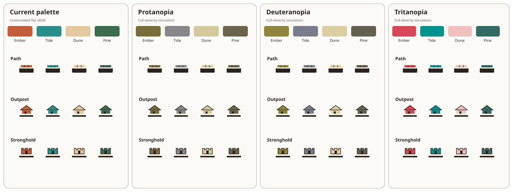

# Seat marks alongside colour

**Status:** design proposal; Jarrod has not selected either option. The current client and host still identify seats by the four palette colours. The mockups below compare the two choices requested in #312; they are not a claim that either has shipped.

## Current palette under colour-vision simulations

The figure shows the current four flat seat swatches and the three piece silhouettes used in the game (path, outpost and stronghold) in the original palette and under full-severity protanopia, deuteranopia and tritanopia simulations. Each piece row includes Ember, Tide, Dune and Pine. The illustrations are flat-material schematics based on the piece forms in [pieces.md](pieces.md); they do not imitate the renderer's lighting, texture or tone mapping.

| Seat | Current | Protanopia | Deuteranopia | Tritanopia |
|---|---|---|---|---|
| Ember | `#c45c3e` | `#786d3b` | `#91843c` | `#d74755` |
| Tide | `#2a8f8a` | `#87878a` | `#787c8b` | `#00938d` |
| Dune | `#e4c9a0` | `#d4c99d` | `#dbcfa1` | `#efc1be` |
| Pine | `#3d6b4f` | `#6b644d` | `#635f51` | `#336a63` |

The pairwise colour differences below are CIEDE2000 (ΔE00), rounded to one decimal, calculated from the simulated sRGB colours. They show why a palette-only solution needs testing under each simulation: Ember and Pine are only 8.4 ΔE00 apart in the protanopia simulation. A value of 15 is used here as a rough design target for distinct adjacent seat identities, not as a WCAG requirement or a guarantee of accessibility.

| Seat pair | Protanopia | Deuteranopia | Tritanopia |
|---|---:|---:|---:|
| Ember – Tide | 22.6 | 30.6 | 58.3 |
| Ember – Dune | 29.4 | 22.9 | 29.3 |
| Ember – Pine | **8.4** | 20.8 | 50.7 |
| Tide – Dune | 26.2 | 35.1 | 46.1 |
| Tide – Pine | 18.9 | 19.3 | 15.2 |
| Dune – Pine | 33.5 | 37.9 | 51.8 |

## Two design options

### A. Replace the palette

As a palette-only mockup, the four swatches below use four colours from the Okabe–Ito palette. This is an example to test, not a selected replacement. Its minimum pairwise ΔE00 is 20.6 under protanopia, 22.3 under deuteranopia and 19.9 under tritanopia with the same simulation and measurement method.

| Seat | Example replacement swatch |
|---|---|
| Ember | Vermillion `#d55e00` |
| Tide | Blue `#0072b2` |
| Dune | Yellow `#f0e442` |
| Pine | Sky blue `#56b4e9` |

A palette change affects every coloured piece and existing `emberisle-color` preferences. The host currently accepts only the supported palette swatches; an implementation would update the palette array in `src/lib/game/types.ts` and choose a saved-colour fallback for colours that are no longer supported. Before selection, test the full game palette against all terrain and piece materials, not just these flat swatches.

### B. Keep the palette and add a fixed seat mark

The second mockup keeps the current palette and adds a persistent geometric mark to the seat colour chip and each seat's pieces. The marks are fixed by seat, regardless of a player's saved colour:

| Seat | Chip and piece mark | Ink on colour patch |
|---|---|---|
| Ember | Solid triangle | Dark `#1c1916` (4.123:1) |
| Tide | Two parallel bars | Dark `#1c1916` (4.495:1) |
| Dune | Open circle | Dark `#1c1916` (10.967:1) |
| Pine | Plus sign | Cream `#fff6e8` (5.740:1) |

These marks use different outlines and fills: triangle, paired lines, ring and cross. Keep them simple and static. The contrast figures are WCAG relative-luminance ratios for the opaque ink and colour patch; all exceed 3:1 for a meaningful graphical mark. Tide's 4.495:1 is just below the 4.5:1 text threshold, so the mark must not replace readable text. At the smallest board view, target an 8 px mark with strokes and gaps around 2 px. Paths project to about 6 px wide, so the mark needs a local seat-colour badge rather than being shrunk to fit.

This option leaves the host protocol and accepted colour values unchanged: marks are renderer-only and the seat-to-mark mapping is determined by seat identity. Use the same mapping in the seat strip, chat names, trade notices and score rows. Keep a written name wherever space permits; a mark supplements the existing label rather than adding a control or requiring players to memorize a separate legend.

**Recommendation:** prefer option B for this stage because it adds a non-colour cue without changing saved colours or host validation. Keep the palette as a separate follow-up if playtesting shows the current colours need replacement. This remains a proposal for Jarrod's decision, not an approved implementation choice.

## Checks before implementation

- If option A is selected, add a check to `scripts/pieces-prove.mjs` that every seat pair stays above an agreed ΔE00 threshold under all three simulations, then check each final piece against every terrain material. Confirm the host accepts only the replacement swatches and that `emberisle-color` falls back safely when a saved value is unsupported.
- If option B is selected, verify every path, outpost and stronghold renders the seat's badge in the renderer, including the path's local colour patch. Check the same seat-to-mark mapping in compact seat, chat, trade and score UI.
- Review the board at phone and desktop sizes and in the tilted camera. Lighting, texture, shadows, antialiasing and tone mapping can reduce effective contrast. Ask players with colour-vision differences to review the result; simulation is a design aid, not a substitute for feedback.

## Methods and limits

The simulations apply the full-severity Machado, Oliveira and Fernandes colour-vision-deficiency matrices to linear sRGB, clamp out-of-gamut channels, then encode the result as sRGB. ΔE00 uses the CIEDE2000 formula on D65 Lab values converted from those simulated sRGB colours. Values are rounded to one decimal, so they are comparative design evidence rather than exact perceptual predictions. The figure uses the same transformed colours for the piece fills; dark and cream rims are also transformed. These calculations do not simulate an individual viewer or the rendered 3D scene.

Ink-to-patch ratios use WCAG relative luminance on the opaque flat sRGB values: linearize each normalized channel at 0.04045, weight it by 0.2126 / 0.7152 / 0.0722, then divide the lighter luminance plus 0.05 by the darker luminance plus 0.05. They do not describe the rendered 3D pieces against every terrain tile.

## Sources

- Machado, Oliveira and Fernandes, [A Physiologically-based Model for Simulation of Color Vision Deficiency](https://doi.org/10.1109/TVCG.2009.113) — simulation matrices.
- [WCAG 2.2: Use of Color](https://www.w3.org/WAI/WCAG22/Understanding/use-of-color.html) — colour must not be the only visual way to convey information.
- [WCAG 2.2: Non-text Contrast](https://www.w3.org/WAI/WCAG22/Understanding/non-text-contrast.html) — meaningful graphical objects need 3:1 contrast against adjacent colours.
- [WCAG 2.2: Contrast Minimum](https://www.w3.org/WAI/WCAG22/Understanding/contrast-minimum.html) — ordinary text needs 4.5:1.
- [WCAG 2.2 relative luminance](https://www.w3.org/TR/WCAG22/#dfn-relative-luminance) — contrast calculation used above.
- [Piece scale and terrain contrast](pieces.md) — current overhead scale, piece geometry and terrain checks.
- `PLAYER_COLORS` in `src/lib/game/types.ts` — source of the four current seat colours.
