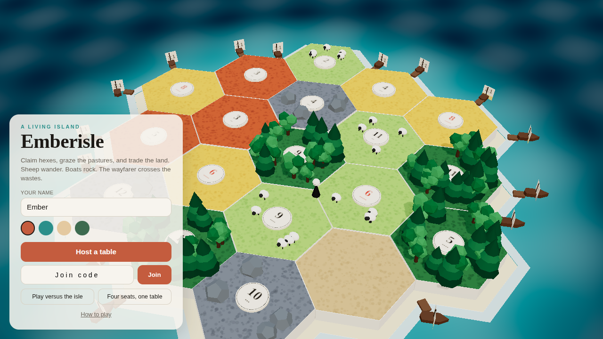
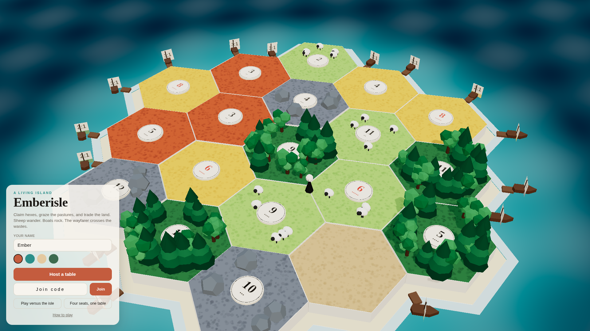
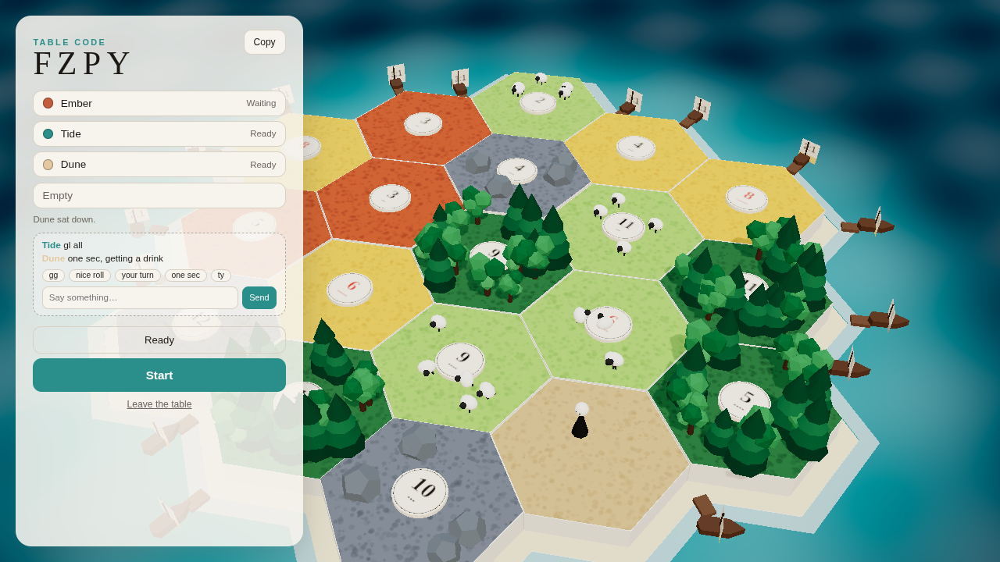
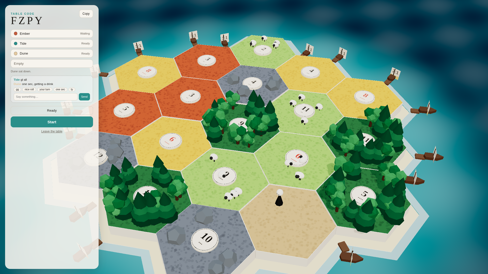

# The title and lobby screens (issue #136)

Sources: [docs/research/visual-polish.md](../research/visual-polish.md) §8, [docs/research/title-menu.md](../research/title-menu.md)
(#148), [docs/research/competing-games.md](../research/competing-games.md) (#144, skimmed per #136's own comments),
[docs/design/menus.md](menus.md) (`Row_Colors`, `WBP_Lobby`, "no panel covers the center third"),
[docs/design/chat.md](chat.md) "Lobby" (the chat box this node places), `src/components/game/EmberisleApp.tsx`
(`Title`, `Lobby`), `src/components/game/Hud.tsx` (the existing glass-card class, and `HowTo`), `src/lib/game/store.ts`.

Target: desktop, 1280×720 and up, same as #119. Phone layouts are out of scope.

## What is wrong today

Both `Title` and `Lobby` share one layout: `absolute inset-0 z-10 flex flex-col justify-end … p-5 sm:p-10`, a
`max-w-md` column pinned to the bottom-middle, with no card background of its own — only a
`bg-gradient-to-t from-bg via-bg/40 to-transparent` wash. Confirmed in `test-results/shots/01-title-1280x720.png`
and `02-lobby-1280x720.png` on a fresh `node scripts/shots.mjs` after #141 (the demo island):

- **The card sits over the island's middle**, the one part of the "poster" (#141's dealt demo island) a first
  impression should show off. At 1920 it is a narrow strip in the middle of a much bigger scene.
- **The card has no background of its own at the top**, only the gradient. Title text sits directly on whatever
  the render behind it happens to be — legible here only because the gradient's `via-bg/40` stop happens to
  reach that high; it is not a stated rule, so it breaks the moment the island's colors shift under it.
- **Five same-weight buttons** on Title: Practice, Hotseat, Host, and Join (a field) all look equally important.
  The game-night path (Host, Join) is what four friends actually use.
- **Dune's `#e4c9a0`** is a plain 12 px dot with no border, and it is close to `bg-surface` (`#f7f4ee`), the
  lobby row's own background — on a bright display the dot nearly disappears into the row (`docs/design/menus.md`
  already names ths exact swatch as a readability risk, `Row_Colors`).
- **No copy button** next to the table code (`docs/design/menus.md` `WBP_Lobby` calls for one; the browser
  client never got it).
- **Ready and Start are the same size and weight** (`Button size="lg"`), though Start is the action that
  actually moves the table on; Ready is closer to a checkbox.
- **"How to play" does nothing on Title.** `setHowTo(!howTo)` flips the store flag, but `<HowTo>` is only
  mounted inside `Hud.tsx`'s `main` return, which never renders while `screen === "title"`. Clicking it during
  the four-friend flow, before a table exists, is silently a no-op. `docs/research/title-menu.md` flagged this
  as a likely small bug for this node to notice; it is real, and small enough to fix here.

## The corner: bottom-left

`docs/research/title-menu.md` left the exact corner open ("Design picks with screenshots, not this note").
Bottom-left keeps the title wordmark and the name field over open water in the demo seed's current framing
(`DEMO_SEED 20260921`, `docs/design/ocean.md`); the approaching boats and the busiest hex cluster stay on the
right, unobstructed. Both `Title` and `Lobby` move here, so the panel appears to live in the same place across
the two screens instead of jumping.

## The card: reuse the HUD's own glass, not a new pattern

Both screens get one wrapper, replacing the full-bleed gradient:

```tsx
// Title
<div className="absolute bottom-5 left-5 z-10 w-full max-w-sm sm:bottom-10 sm:left-10">
  <div className="rounded-[20px] border border-white/50 bg-white/45 p-5 backdrop-blur-md sm:p-6">
    {/* existing Title content */}
  </div>
</div>

// Lobby (taller, and it now must fit the #119 chat box, so it scrolls instead of overflowing)
<div className="absolute bottom-5 left-5 top-5 z-10 flex w-full max-w-sm flex-col sm:bottom-10 sm:left-10 sm:top-10">
  <div className="flex min-h-0 flex-1 flex-col overflow-y-auto rounded-[20px] border border-white/50 bg-white/45 p-5 backdrop-blur-md sm:p-6">
    {/* existing Lobby content, plus the fixes below */}
  </div>
</div>
```

`border-white/50 bg-white/45 backdrop-blur-md` is the exact class `Hud.tsx` already uses for the phase pill,
the action bar, and the log line (`Hud.tsx` ~line 73, 93, 113). Title and Lobby reusing it, instead of the
one-off gradient wash, means text is legible over any part of the render behind it — the island, the ocean, or
a dense cluster of boats — not only the strip the old gradient happened to darken.

## Mockups (Playwright, 1280×720 and 1920×1080)

Each is the real client — the live demo island behind it, `localStorage["emberisle-name"] = "Ember"`, and for
the lobby shot, two real seats joined over the socket (Tide, Dune) — with the existing panel hidden and the
proposed one drawn over it in HTML at the exact position and copy above, so the layout and proportions are
real, not a sketch.

| | 1280×720 | 1920×1080 |
|---|---|---|
| **Title** |  |  |
| **Lobby** |  |  |

## Title: weight Host + Join, demote Practice / Hotseat

Per `docs/research/title-menu.md` point 3 ("Weight the game-night path"):

- **Host a table**: stays `size="lg"`, but its variant becomes the filled `accent` (today it is `secondary`,
  the same weight as Practice and Hotseat).
- **Join code + Join**: unchanged fields and handler, grouped directly under Host so the two-friend path reads
  as one block.
- **Play versus the isle** and **Four seats, one table**: drop from `size="lg"` to a smaller `size="sm"`
  (or an explicit `h-9 text-sm`) `variant="outline"` pair, side by side in one row instead of stacked — two
  secondary text-weight actions, not two more full-width buttons the same size as Host.
- **How to play**: stays `variant="ghost"`, centered below. Fixes the no-op: export `HowTo` from `Hud.tsx`
  (`export function HowTo`) and mount `{howTo ? <HowTo onClose={() => setHowTo(false)} /> : null}` in `Title`
  too, exactly as `Hud.tsx` already does. No change to `HowTo` itself.
- Name field and the four color swatches (`#142`) are unchanged in behavior, only carried inside the new card.

## Lobby: copy button, a visible Dune, weighted Ready/Start, room for chat

- **Copy button**: a small button beside the code, `navigator.clipboard.writeText(code)`, label flips to
  "Copied" for 1.5 s then back to "Copy" (the same timeout pattern `chat.md`'s presets use for one-shot
  feedback, nothing new). Falls back to doing nothing but showing the code selectable if `navigator.clipboard`
  is unavailable — never throws.
- **Every seat dot gets a ring**: `size-3 rounded-full ring-1 ring-inset ring-black/25`, not just `bg-{color}`.
  Checked against all four `PLAYER_COLORS`: Ember `#c45c3e` and Pine `#3d6b4f` were already fine; the ring is
  what fixes Dune `#e4c9a0` and keeps Tide `#2a8f8a` fine too. One class, on every dot, not a Dune-only special
  case.
- **Ready** drops to `variant="outline"` (it is a toggle, not the table's action). **Start** stays
  `variant="sea"` but grows to the visually heaviest control on the screen (kept `size="lg"`, and it is now the
  only filled button in the card once Ready is outlined) — the same "your own react/trade menu" weighting
  principle `chat.md` uses for its primary vs. secondary rows.
- **The chat box** (`docs/design/chat.md` "Lobby": the log, presets, emote tray, and input, always open, 6
  visible lines then a scroll) mounts directly under the seat list and the `lobbyLog`/error line, inside this
  same card. This node does not redesign it — `chat.md` already fully specs its contents — it only places it
  and makes the card scroll (`overflow-y-auto` above) so a 4-seat table plus the chat box never gets clipped at
  720p. The mockups above draw the placed box from that spec so the completion test's "chat area … placed" is
  checkable without waiting on #119's implementation children.
- Seat rows, the log line, and `Leave the table` are otherwise unchanged in behavior.

## Files the implementation touches

- `src/components/game/EmberisleApp.tsx`: `Title` and `Lobby`'s wrapper + card markup, the demoted button
  variants/sizes, the copy button and its handler, the seat dot ring class, the `HowTo` mount.
- `src/components/game/Hud.tsx`: `export` on `HowTo` (signature unchanged).
- No store, host, or message changes. No new dependencies (`navigator.clipboard` is a browser API already
  available; no polyfill).

## Completion test

Per #136's own completion test, `node scripts/shots.mjs` (`ONLY=1280` and `ONLY=1920`) after the implementation
must show, in `01-title-*` and `02-lobby-*`:

- the demo island visible and unobstructed through most of the frame, not just around a bottom strip;
- all four seat colors (including Dune) readable in the lobby list;
- a copy button next to the table code;
- the chat area from #119 placed under the seat list.

`npm run typecheck`, `npm test`, and `npm run tabs-prove` must stay green — this node touches no message
shape, so none of those should need a change. `npm run client-prove` (which starts from Title) is the
regression check that clicking Host/Join/Practice still works with the new markup.

## Out of scope

Re-litigating #142's color picker itself, the in-game chat dock and player menu (#119/#159-162, separate
screens), phone layouts, and any change to `HowTo`'s own content.

## Child issue filed

- **#167 Implement the title and lobby layout**: `EmberisleApp.tsx`, `Hud.tsx`'s `HowTo` export, per this doc.
  Depends on this design landing. Size S.
